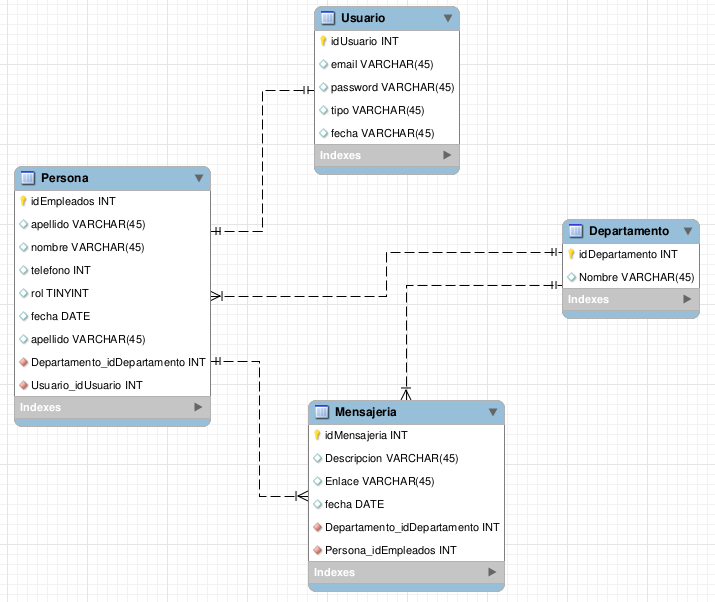
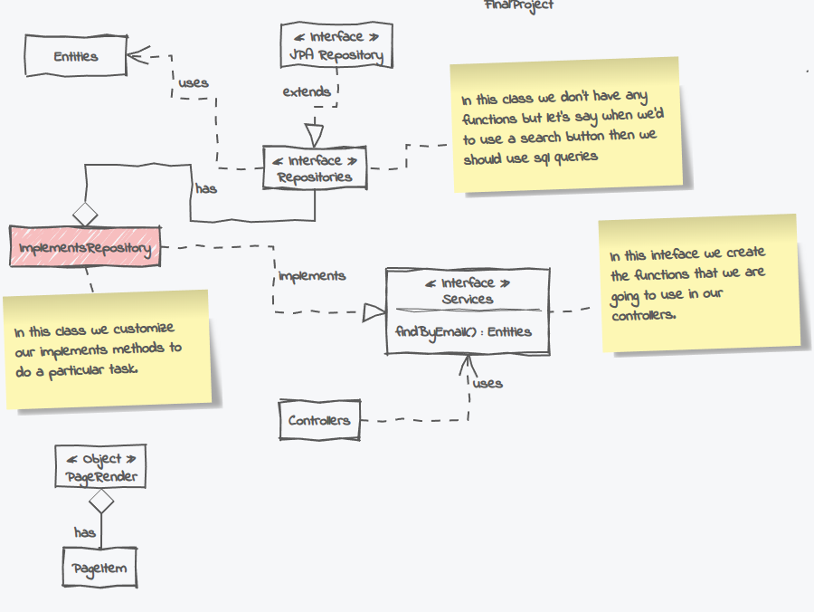
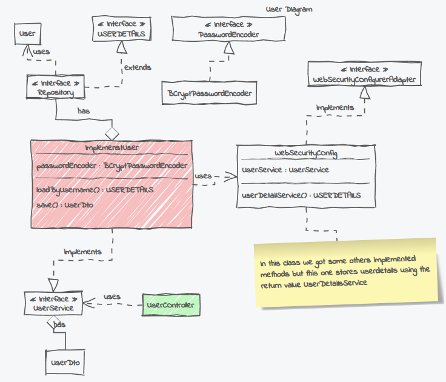
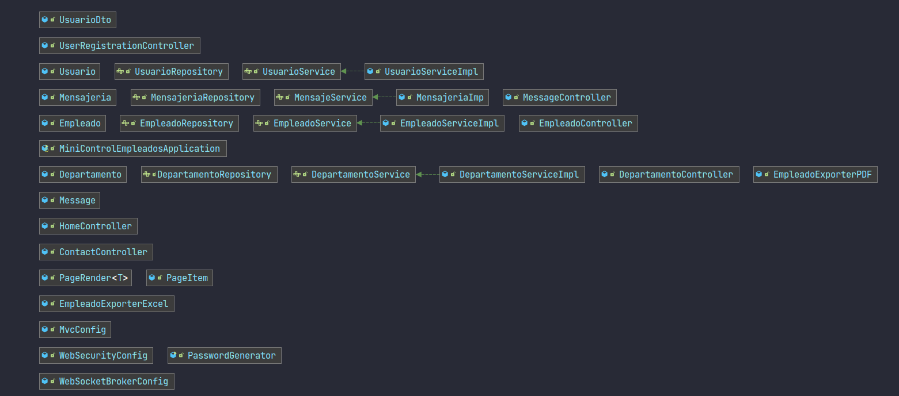

### BIENVENIDO A MI PROYECTO

En mi proyecto me he enfocado en realizar un plantel para la gestion de empleados en una empresa.

#### - OBJETIVO PRINCIPAL

El objetivo es simplemente tener una mejor gestion y comunicacion con los empleados de una empresa.

#### - BASE DE DATOS

#### - DIAGRAMA DE CASOS DE USO

***Lineas Generales***

***Usuario***

***Mas exactos***

#### - HERRAMIENTAS 

**Parte Front End**

Básicamente, me he enfocado más en la funcionalidad del framework que en el propio estilo de la página, es por eso mismo
que me he visto obligado hacer uso de una libreria de css como Bootstrap.

Hago uso también de un componente de springboot que es thymeleaf que nos sirve para poder interactuar con nuestros objetos 
con el html.

**Parte del servidor**

Utilizo spring boot donde creo metodos para proveer datos a nuestro cliente.

**Dependencias de terceros**

Dependencias que me han ayudado a completar tareas para mi proyecto.

#### - FUNCIONALIDADES DE LA APLICACION WEB

Las principales funciones de mi aplicacion es tener dos tipos de usuarios, donde tenemos 
el administrador y el usuario normal.
Para ser más concreto el administrador tiene privilegios que el usuario no posee es decir, el adminstrador
puede eliminar, agregar y editar empleados. También posee la funcion de generar pdf y fichero de excel del listado de los 
empleados.
El administrador puede anyadir un usuario siempre y cuando exista un empleado sin un usuario asignado, es decir si el adminitrador
desea agregar un nuevo usuario y no hay empleados disponibles (empleados que no tengan asignado un usuario) entonces la aplicacion
informara al administrador que tiene que anyadir primero un empleado (obviamente sin usuario) que por defecto cuando se crea no asigna 
ningun usuario.

Por parte del usuario normal (empleado) posee la funcion de consultar su perfil, consultar la plantilla de trabajadores de 
su departamento y editar sus datos personales, pero con la restriccion de no poder cambiar el usuario ya asignado por el administrador.

Ambos tipos de usuarios pueden enviar correos electronicos.

#### - RECOMENDACION DE USO

Crear una base de datos llamada employees.

Mi recomendacion de uso seria que primeramente deberíamos de tener creado un usuario por defecto en este caso preferiblemente 
de tipo administrador para poder sacar el maximo recurso posible de la aplicacion.
Por ejemplo implemetariamos el fichero de sql que he generado en la aplicacion llamado **query.sql** donde podríamos observar que existe varios insert
para tablas específicas, en la cual deberíamos enfocarnos en la tabla de empleados y de usuarios.

Después tendriamos que entrar con este enlace http://localhost:8080/home para comenzar la aplicacion, ya que sería nuestra página principal para poder hacer uso de nuestra aplicacion
desde el principio y consecutivamente entrar con las credenciales del administrador o usuario ya creados como mencionamos con anterioridad.

Podemos iniciar este proyecto con la base de datos y datos ya creados usando uso del fichero proveido llamado **query.sql**.

#### - PROBLEMAS ENCONTRADOS

Primeramenta el problema que he encontrado fue la planificación de la base de datos, ya que fue bastante confuso desde 
el principio al hacer uso del JPA Hibernate.

#### - VALORACION PERSONAL 

Estoy muy contento de los conocimientos adquiridos, pero me gustaria implementar más funciones a mi aplicacion y no hacer uso de 
Thymeleaf, ya que veo que me imposibilita en crear más funcionalidad desde mi frontend y hacer uso de otras herramientas de frontend.

#### - EJEMPLO PRACTICO

[//]: # (![Alt Text]&#40;admin.gif&#41;)

[//]: # (//asldfjlsajf)

